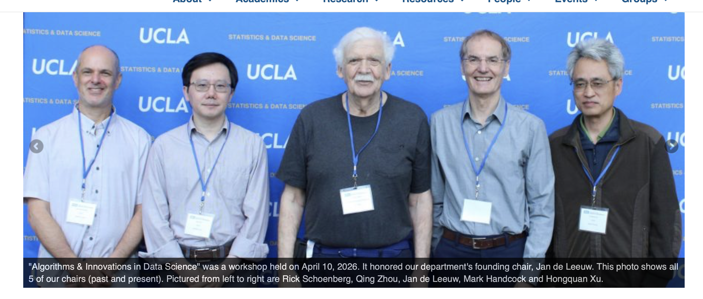

# Repositories (2026-04-14)

Over the last couple of years I have written a large number of R codes for
matrix approximation, multidimensional scaling, and multivariate analysis.
The general approach is to write a stand-alone R program and in addition an R driver that
uses .C() to call a shared library, which is by itself a stand-alone
C program. The main recent projects are C versions of the smacof MDS
majorization (MM) method with extensions to Sammon mapping, Elastic Scaling, 
strain, fStress, rStress -- all written in both R and C, all with both
metric and non-metric versions.

The papers/manuals/vignettes, largely unpublished and often unfinished, are at
https://jansweb.netlify.app/publication and the corresponding C, h, R, pdf,
qmd, tex, bib files are at https://github.com/deleeuw?tab=repositories. I am not
interested in transforming these papers/codes to full-fledged publications,
but in the current form they maybe useful to some. Everything in the repositories
is open source with a CC0 license, so the files can be used in whatever way you see fit. 
Attribution is appreciated, but not required.
On the other hand, all suggestions for improvement of paper and code are welcome.

# Five Chairs, No Table (2026-04-21)

# Matrix Approximation (2026-04-22)

"Matrix Approximation with Kronecker and Precision Weighting" by
De Leeuw and Graffelman is at 

<https://jansweb.netlify.app/publication/deleeuw-graffelman-e-26-d/>

and the files are at 

<https://github.com/deleeuw/triple>

There are two R programs (triple.R and nested.R) for minimizing the
loss function trace(R(W*(Y-X))C(W*(Y-X))') over a set in matrix space
(for example the matrices of rank ≤ p, or the Hankel matrices, or
whatever). Here Y is the matrix to be approximated, X is the
approximating matrix, R and C are psd weight matrices, W is a non-negative
matrix of weights, and * is Hadamard (elementwise) multiplication.
Both programs use majorization (MM), the function nested() uses
a nice nested majorization. The type of approximation wanted is
a parameter, the name of a function for unweighted least squares
approximation (defaults to eckart-young()). The file auxiliary.R
contains nine different approximation routines that can be used
in both nested() and triple().

As always, everything is public domain, and both paper and code may
change many times

# Workshop (2026-04-24)

On April 10, to celebrate my 80th birthday, my old department organized a [workshop](https://deleeuwworkshop.stat.ucla.edu) 
he presentations are now online
at <https://deleeuwworkshop.stat.ucla.edu/#schedule>. I once more, and probably for the last time, flew to LA. It was good to see old friends, to meet new faculty and students, and to mosey around
in familiar surroundings. I had a good time.

# Matrix Decomposition (2026-04-24)

<https://github.com/deleeuw/decomp> has R code and paper for matrix 
approximation of Y by X in the Kronecker norm
tr R(Y-X)C(Y-X)', with R and C positive semi-definite matrices. 
Subroutines for various choices of X, including low-rank
approximation, are provided.